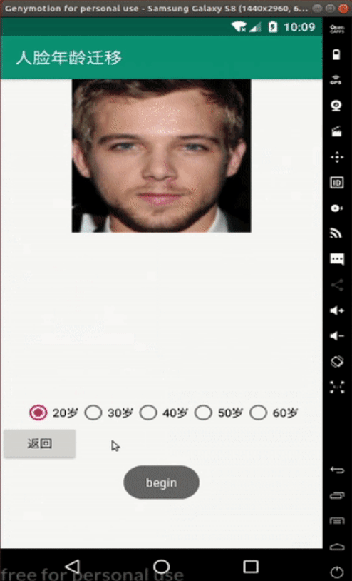

# IPCGANs-Android-Demo

> Author: Yuchao Gu

> E-mail: gyc.nankai@gmail.com

> Date: 2019-06-24

> Description: The code is an Android demo for cross-age generation

---

## Description

This project is used to display algorithm described in [IPCGANs](http://openaccess.thecvf.com/content_cvpr_2018/papers/Wang_Face_Aging_With_CVPR_2018_paper.pdf).

Notes: This project is not alone, the [server project](https://github.com/guyuchao/IPCGANs-Pytorch) must be running before this Android demo.

## Visualize

## Dependencies

This project developed on the following environments:

* Android-Studio
* Genymotion
